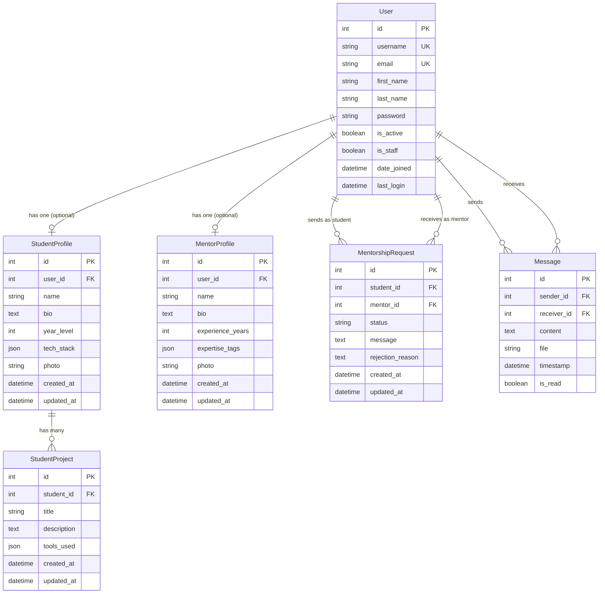

# DevGuidance ERD - Visual Representation

## Entity Relationship Diagram (Mermaid Format)

## Database Schema Summary

### Primary Entities
- **User**: Core authentication and user data (Django built-in)
- **StudentProfile**: Student-specific information and preferences
- **MentorProfile**: Mentor-specific information and expertise
- **StudentProject**: Projects created by students
- **MentorshipRequest**: Requests for mentorship between students and mentors
- **Message**: Communication between users

### Key Relationships
1. **User ↔ StudentProfile**: One-to-One (optional)
2. **User ↔ MentorProfile**: One-to-One (optional)
3. **StudentProfile → StudentProject**: One-to-Many
4. **User → MentorshipRequest**: One-to-Many (as both student and mentor)
5. **User → Message**: One-to-Many (as both sender and receiver)

### Business Rules
- A user can be either a Student OR Mentor (not both)
- Students can have multiple projects
- Students can send multiple mentorship requests
- Mentors can receive multiple mentorship requests
- Only one active mentorship per student-mentor pair
- Real-time messaging between connected users

### Data Types Used
- **JSON Fields**: For flexible data like tech_stack, tools_used, expertise_tags
- **ImageField**: For profile photos with automatic processing
- **FileField**: For message attachments with validation
- **DateTime**: For timestamps and audit trails
- **Constraints**: Unique constraints prevent duplicate active mentorships

This ERD represents a normalized, scalable database design that supports the complete mentorship platform workflow. 